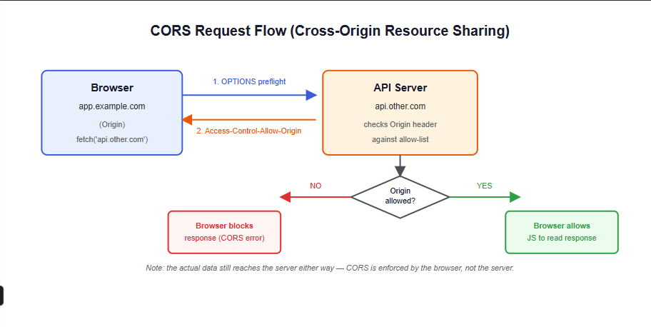
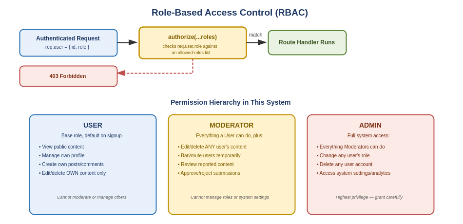
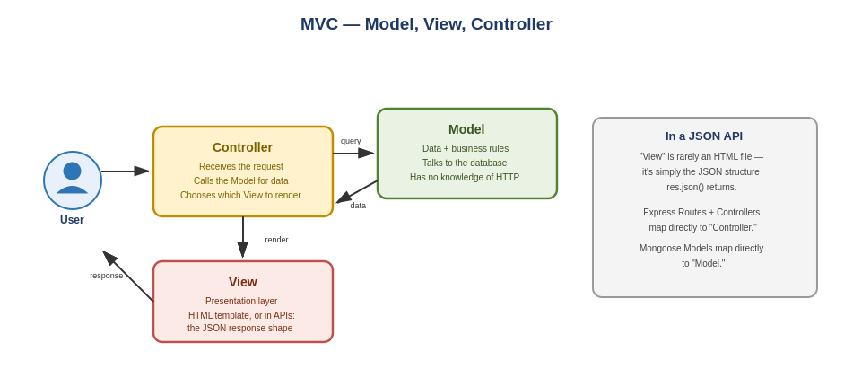
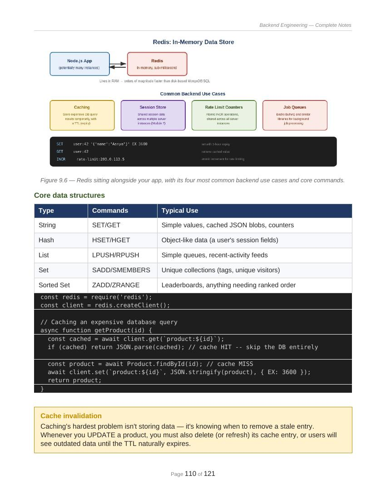

````md
# 🚀 Backend Engineering Master Notes

A complete **Backend Engineering Handbook** covering everything from fundamentals to advanced production-level backend development using:

- JavaScript
- Node.js
- Express.js
- MongoDB
- Authentication & Authorization
- Security
- System Design Basics
- Production Deployment

Designed for:
- Students preparing for placements
- Backend developers
- SDE interview preparation
- Full-stack developers wanting strong backend fundamentals

---

# 📚 What’s Inside

This repository contains structured PDF notes covering:

## Phase 1 — Foundations
- Backend Fundamentals
- Client-Server Architecture
- HTTP / HTTPS
- Request-Response Lifecycle
- JavaScript for Backend
- Event Loop
- Node.js Architecture

---

## Phase 2 — Backend Development
- Express.js
- Routes
- Middleware
- Controllers
- Error Handling
- MongoDB
- Mongoose

---

## Phase 3 — Authentication & Authorization
- Session-based Authentication
- Token-based Authentication
- JWT
- Access Token
- Refresh Token
- bcrypt
- RBAC

---

## Phase 4 — Advanced Backend
- MVC Architecture
- Service Layer
- Repository Pattern
- Redis
- Queues
- Cron Jobs
- Pagination
- Filtering
- Scalability

---

## Phase 5 — Security & Production
- Helmet
- CORS
- Rate Limiting
- XSS
- CSRF
- NoSQL Injection
- Docker
- CI/CD
- Monitoring

---

## Phase 6 — Production Project
Complete backend architecture for:
> AI Interview Platform

Includes:
- Auth
- Role Management
- AI APIs
- Analytics
- Logging
- Security

---

# 🔥 Features of These Notes

✅ Beginner to Advanced  
✅ Theory + Code Examples  
✅ Architecture Diagrams  
✅ Backend Flow Charts  
✅ Production-Level Concepts  
✅ Interview Questions  
✅ Revision Notes  

---

# 🖼️ Notes Preview




---

## Role Based Access Control (RBAC)


---




---





---

# 🛠 Tech Stack Covered

- JavaScript
- Node.js
- Express.js
- MongoDB
- Mongoose
- JWT
- bcrypt
- Redis
- Docker

---

# 📂 Repository Structure

```bash
backend-engineering-notes/
│
├── notes/
│   ├── phase-1-foundation.pdf
│   ├── phase-2-express-mongodb.pdf
│   ├── phase-3-auth.pdf
│   ├── phase-4-advanced-backend.pdf
│   ├── phase-5-security-production.pdf
│   └── phase-6-project-architecture.pdf
│
├── screenshots/
│   ├── backend1.png
│   ├── eventloop.png
│   ├── auth.png
│   └── architecture.png
│
└── README.md
````

---

# 🎯 Who Should Use These Notes?

These notes are useful for:

* College students
* Placement preparation
* Backend interview preparation
* Developers transitioning into backend
* Full-stack engineers

---

# 📌 Topics Covered

* Backend Basics
* JavaScript
* Node.js
* Express.js
* MongoDB
* Mongoose
* Authentication
* Authorization
* Security
* Production Backend
* System Design Basics

---

# 💡 Learning Roadmap

```text
JavaScript
   ↓
Node.js
   ↓
Express.js
   ↓
MongoDB
   ↓
Authentication
   ↓
Authorization
   ↓
Security
   ↓
Advanced Backend
   ↓
Production Architecture
```

---

# ⭐ Why This Repository?

Most resources either:

* Teach only theory
  OR
* Teach only code

This repository combines both.

You’ll learn:

* Why things work
* How things work
* How companies build scalable backend systems

---

# 🤝 Contribution

Feel free to:

* Improve notes
* Add diagrams
* Add interview questions
* Add advanced backend topics

---

# 📬 Connect

If this repository helped you, consider giving it a ⭐

---

Made with ❤️ for Backend Engineers

```
```
